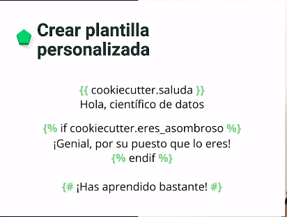
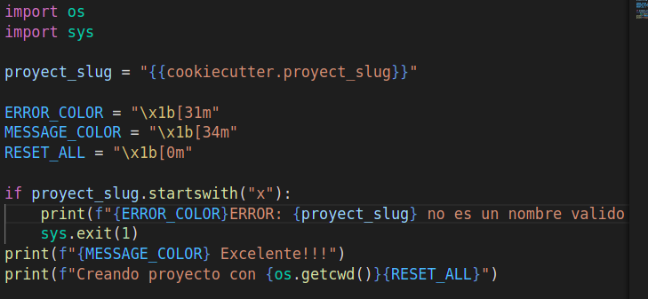
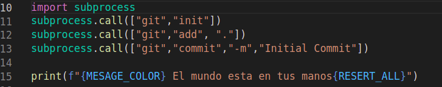

<h1>Entorno de trabajo</h1>

<section>
<h2>Cookiecutter</h2>
Es un manejador de plantillas multiplataformal, por lo que las plantillas se pueden utilizar en cualquier lenguaje de programación o formato de marcado.

</section>

<section>

<h2>Preparación</h2>

- sudo apt-get install cookiecutter
- Se debe instalar conda para tener un entorno mas global.
- Se descarga de la pagina de anaconda.
- export PATH=~/anaconda3/bin:$PATH 
</section>

<h2> Proceso para preparar entornos virtuales </h2>

- conda config --add channels conda-forge 
- conda create -n nombreenv 
- Para activar el entorno virtual : conda activate nombreenv
- Para desactivar el entorno virtual : conda deactivate
- Para exportar el historia de lo que se ha hecho : conda env export --from-history --file environment.yml

# ¿Como utilizar cookiercutter?

tiene bloques de expresión en la cual se guardan los valores. Bloques condicionales y comentarios

- Se tiene que crear una carpeta  con el nombre de{{cookiecutter.Variable}}, donde en Variable luego será defina en un archivo json.
- Dentro de esta carpeta se creará todo el diagrama necesario para tener una plantilla

## Comandos:

- {{cookiecutter.**nom_varia**}}
-  
# Implementar un hooks

Un hook es una acción que se hace antes o despues de crer el cookiercutter, se crean dos archivos.py dentro de una carpeta llamada hooks, **pre_gen_project.py** y **post_gen_project.py**.

# **pre_gen_project.py**

 

# **post_gen_project.py**

 

## Usar github
Para usar una plantilla que se encuentra en git hub simplemente se usa el comando
- **cookiecutter** "path_git_hub"

## Manejo de excepciones

La documentación nos resalta y recuerda lo importante que es el manejo de excepciones, por ejemplo si tenemos un proceso iterativo y queremos que finalice por todos los elementos así sea que durante su ejecución tenga errores.

## Plantillas de data science con conda

- cookiecutter https://github.com/jvelezmagic/cookiecutter-conda-data-science

## Plantilla de data science con pip

- cookiecutter -c v1 https://github.com/drivendata/cookiecutter-data-science